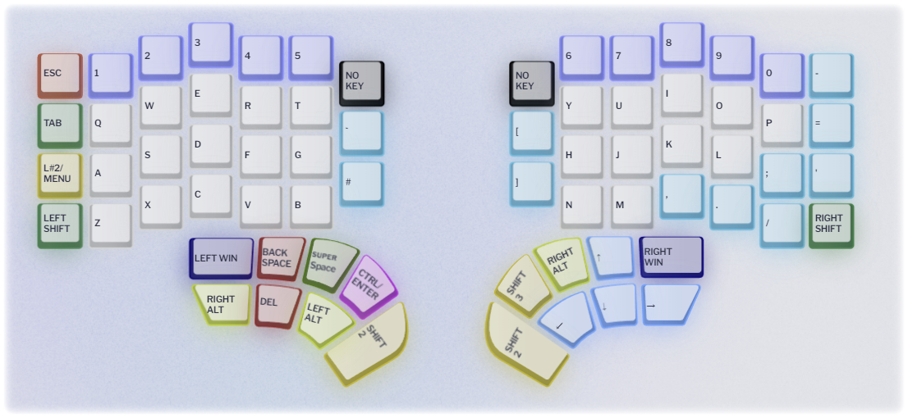
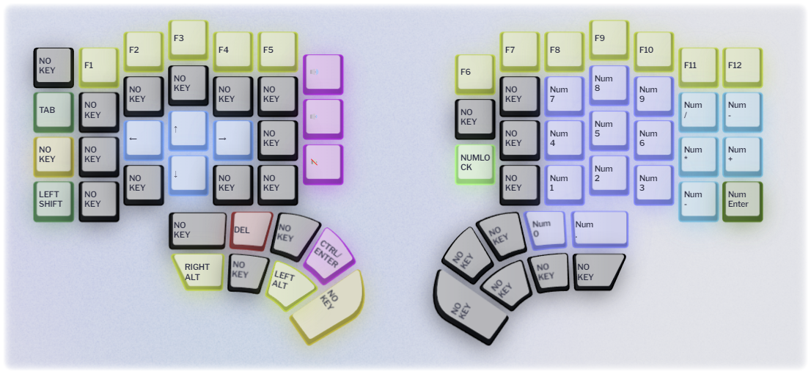
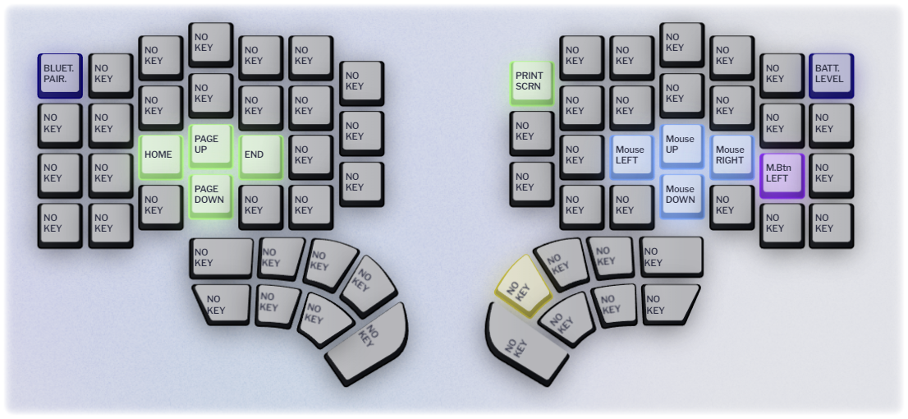
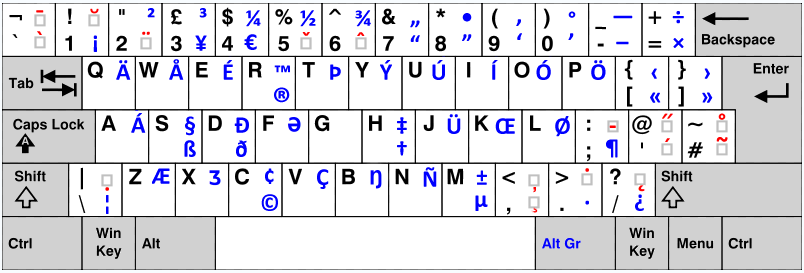

# MyKeyWay-Defy
This is my Dygma Defy layer collection.

This is a small breakdown of my reasoning for the key positioning. 
Don't forget: It always takes a while to get used to a new key layout, take your time and most importantly, enjoy your new keyboard!

I'll update the layout and info here when I make any significant changes.

You can download the whole profile [here](Json/MyKeyWay-Defy.json). Or each layer individually: [L1](Json/L1.json), [L2](Json/L2.json), [L3](Json/L3.json).

## **Default Layer**

* The letters are arranged in a standard QWERTY layout for familiarity.
* Essential modifiers like Ctrl, and Alt are within easy reach of the thumbs, reducing finger strain.
* The 'Backspace' and 'Enter' keys are positioned on the thumb clusters to allow quick corrections and command executions without moving the hands away from the home row.
* The shift keys are left in they regular position since from experience it's the best use for the pinky.

## **Function Layer (2)**

* F-keys are aligned with their corresponding number keys for intuitive access.
* Navigation keys (arrows, Home, End, Page Up, Page Down) are centrally located for quick document manipulation.

## **Utility Layer (3)**

* System control keys like 'Print Screen', 'Bluetooth Pair', and 'Battery Level' are on this third layer to prevent accidental activation.
* Mouse control keys are included in the thumb cluster for those who prefer not to switch to an actual mouse or touchpad for small tasks.
* The bluetooth pair is strategically placed on the top left, this is so that I can switch between my computer and my phone/tablet as seemingly as possible.

## 

**Notes & Disclaimers**

* One CTRL is usually enough, even for actions where I don't want to use the right part of the keyboard, for example CTRL+Arrows, I usually just press the CTRL and SHIFT2 key simultanously on the thumb cluster for quicker and easier access to stuff like selecting or jumping around text.
* For gaming and moving the camera in different types of sofware I use **SDFC** (can be seen by the position of the Arrow keys on layer two), this is because I have relatively short fingers, it may be more comfortable for you to use **ESDF** so adjust accordingly.
* This layout should also be compatible with the Colemak layout but you may have to move a few of the symbol keys for better ergonomy.
* The third key from the first column, it's currently a Shift to layer two on hold, as well as the MENU key for a single press, this works great for me so far but I'll take feedback on improving this.
* You may want to fine-tune the activation timing for the long press to suit your typing speed, you can do this on "Preferences -> Typing"
* Regarding the chosen colors, they have been selected with contrast in mind, which generally aids in visibility for individuals with Deuteranomaly (I don't have it but it's the most common so I took that into consideration when configuring the layers)
* I use the RightAlt (AltGr) a lot, the keyboard layout that I use is the UK Intl, it's great for programming and for typing in several languages (I use it for English, German, Portuguese and Spanish), you can find it below,
* The keyboard should be also great for programming, I tested a few thousand lines of code in C, Python, C# and PHP and the heatmap looks good for the most part.
* The extra OS key on the right side is for easy access to shortcuts like WIN+L for quickly locking my workstation.

**What still needs improvement**

* Both the Super space Superkey and the CTRL/ENTER are for easy access to the Enter, while long press for the Enter on Space makes sense to me, I use much more often the CTRL/ENTER, having both is superfluous.
* The Backspace key is used a lot, the Del not so much, that's why it's on the same position as the Backspace key on the layer two, I may end up moving the Del key on the
* I have no use for the top right key (Left half) and top left key (Right half), they are too far to reach comfortable without holding other key, I'm taking suggestions on what could go there.
* CTRL+Backspace could probably need some improvement, taking suggestions on this.

**How to install**

If you want the whole thing, colors included: Drop the json file "blabla-Defy.json" in your Dygma backups folder, which can be found under "Preferences", then restore the backup from there.

If you just want the layers, use the Layout Editor to "Load single layer" on the individual layer json files.

**Layout**

The layout that I use with this keyboard is the UK Intl v2, it's great for programming and for typing in several languages, you can find it [here](https://www.zolid.com/uk-intl-kb/index.htm).

**Changelog**

* Version 1.0
  * First Release